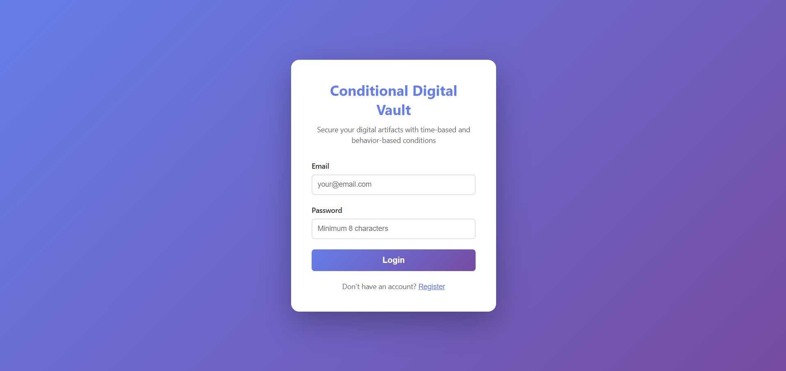
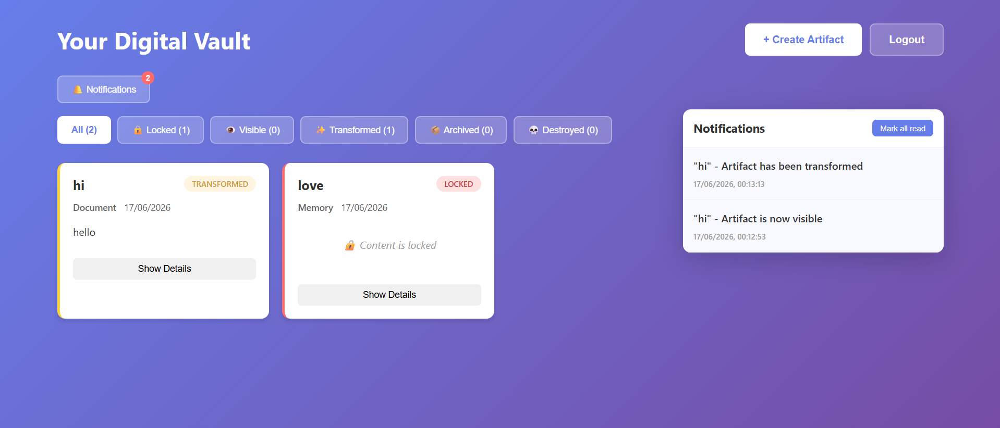
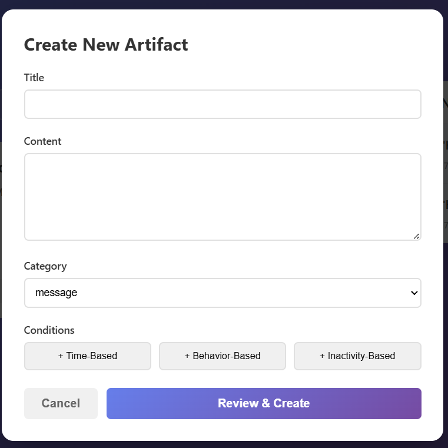

# 🔐 Conditional Digital Vault

A full-stack secure digital vault that allows users to create and manage digital artifacts protected by **time-based**, **inactivity-based**, and **behavior-based** conditions. The application automatically changes the visibility and accessibility of stored artifacts when predefined conditions are satisfied.

---

## 🌐 Live Demo

https://conditional-digital-vault.vercel.app

---

## ✨ Features

- 🔐 Secure JWT Authentication
- 📝 Create Digital Artifacts
- ⏳ Time-Based Conditions
- 💤 Inactivity-Based Conditions
- 🎯 Behavior-Based Conditions
- 🔒 Automatic Artifact Locking
- 👁 Visibility Management
- ✨ Artifact Transformation
- 📦 Archive & Destroy States
- 🔔 Notification Center
- 📊 Dashboard Overview
- 📱 Responsive User Interface

---

# 📸 Screenshots

## Login



---

## Dashboard



---

## Create Artifact



---

## 🛠 Tech Stack

### Frontend

- React
- TypeScript
- Vite
- CSS

### Backend

- Node.js
- Express.js
- TypeScript

### Database

- MongoDB

### Authentication

- JWT
- bcrypt

---

## 📂 Project Structure

```
CONDITIONAL_DIGITAL_VAULT
│
├── backend
│   ├── src
│   ├── dist
│   └── package.json
│
├── frontend
│   ├── src
│   ├── dist
│   └── package.json
│
├── screenshots
│   ├── login.png
│   ├── dashboard.png
│   ├── create-artifact.png
│   └── artifacts.png
│
└── README.md
```

---

## 🚀 Installation

### Backend

```bash
cd backend
npm install
npm run dev
```

### Frontend

```bash
cd frontend
npm install
npm run dev
```

---

## 🔑 Environment Variables

Backend `.env`

```env
MONGODB_URI=your_mongodb_uri
JWT_SECRET=your_secret_key
PORT=5000
```

Frontend `.env`

```env
VITE_API_URL=http://localhost:5000
```

---

## 👨‍💻 Author

**Aradhya Agarwal**

- GitHub: https://github.com/ARADHYA200

---

## ⭐ If you like this project, don't forget to star the repository!